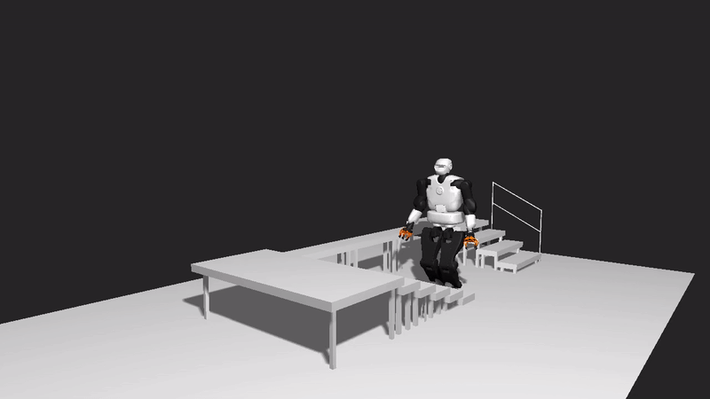
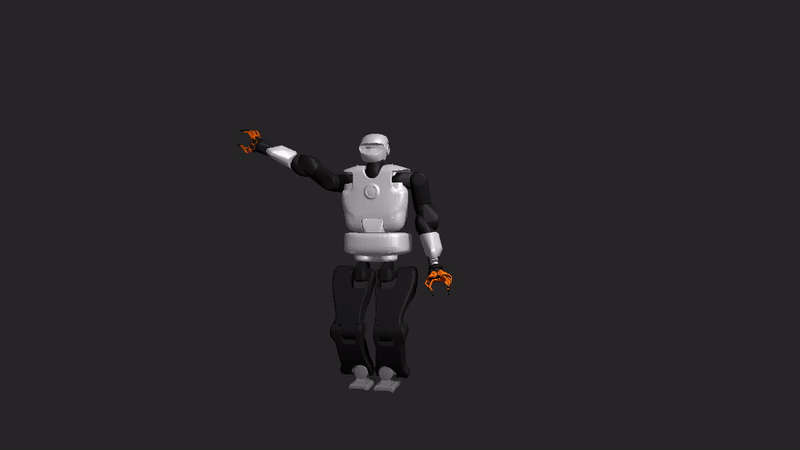
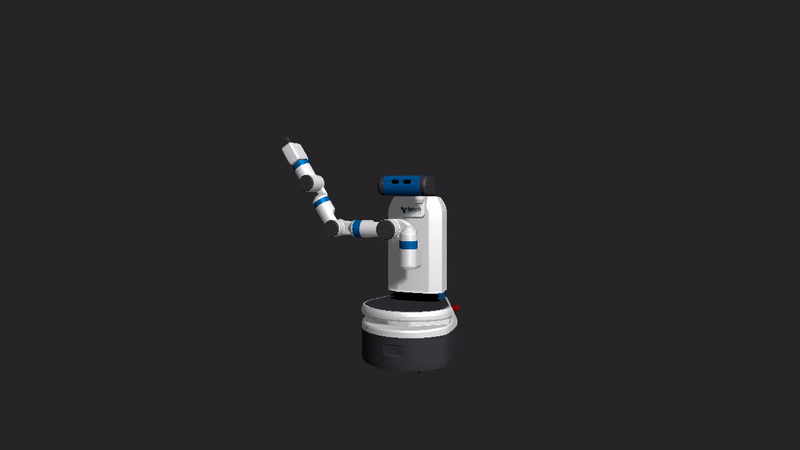

# glURDF
*Tested on both **Ubuntu 16.04** and **18.04**.*



glURDF is a graphical interface for visualizing robot models using URDF and OpenGL.
This repository is based on [learnopengl](https://learnopengl.com) by [Joey de Vries](https://twitter.com/JoeyDeVriez), extended to read [urdf](http://wiki.ros.org/urdf) files. Please refer to this [link](https://github.com/JoeyDeVries/LearnOpenGL/blob/master/LICENSE.md) for the license terms. 
glURDF supports not only visualizing the robot model but also animating the robot motion with given robot configurations.

## Dependencies
glURDF depends on multiple packages and libraries. Please follow the procedure below to make sure you have installed all the dependencies.
- System tools
  ```sh
  sudo apt-get install g++ cmake git
  ```
- packages for graphical interfaces
  ```sh
  sudo apt-get install libsoil-dev libglm-dev libassimp-dev libglew-dev libglfw3-dev libxinerama-dev libxcursor-dev libxi-dev libboost-all-dev
  ```
- packages for reading urdf files

  In order to read urdf files, one has to install the urdfdom package which can come either along ROS library or be installed as a standalone library. Either of them works fine. Below is the procedure for the second option. 

  [urdfdom](https://github.com/ros/urdfdom) depends on both [console_bridge](https://github.com/ros/console_bridge) and [urdfdom_headers](https://github.com/ros/urdfdom_headers). Follow all the command lines below to install all three packages.

  ```sh
  git clone git://github.com/ros/console_bridge.git && cd console_bridge
  mkdir build && cd build
  cmake ..
  make
  sudo make install
  ```
  ```sh
  git clone git://github.com/ros/urdfdom_headers && cd urdfdom_headers
  mkdir build && cd build
  cmake ..
  make
  sudo make install
  ```
  ```sh
  git clone git://github.com/ros/urdfdom && cd urdfdom
  mkdir build && cd build
  cmake ..
  make
  sudo make install
  ```

## Setup
Clone the repository. To compile, it is recommended to create a separate build directory:
```sh
git clone https://github.com/daeunSong/glURDF.git && cd glURDF
mkdir build && cd build
cmake ..
make 
```

## Demo
The demo uses the robot description files from [fetch_ros](https://github.com/fetchrobotics/fetch_ros.git), and [talos-data](https://github.com/stack-of-tasks/talos-data.git). Make sure you have them in resources folder:
```sh
git clone https://github.com/fetchrobotics/fetch_ros.git resources/fetch_ros
git clone https://github.com/stack-of-tasks/talos-data.git resources/talos_data
```

To visualize the robot, run the script below:
```sh
cd build/bin
./glURDF
```
You can try visualizing different robots by changing the filepaths.

To run the demo of the talos robot motion, run the script below:
```sh
cd build/bin
./demo_talos [DEMO_SCENE]
```
Currently, *ground*, *bridge*, and *stairs* demo scenes are available.

Or just say hi to talos and fetch! 👋
```sh
cd build/bin
./demo_talos_say_hi
./demo_fetch_say_hi
```
 

Some keyboard inputs are available:
- **WASD**: camera movement
- **Q**: shadow ON/OFF
- **arrow UP/DOWN**: brightness of the light
- **space bar**: (only for the demo) replay the motion
